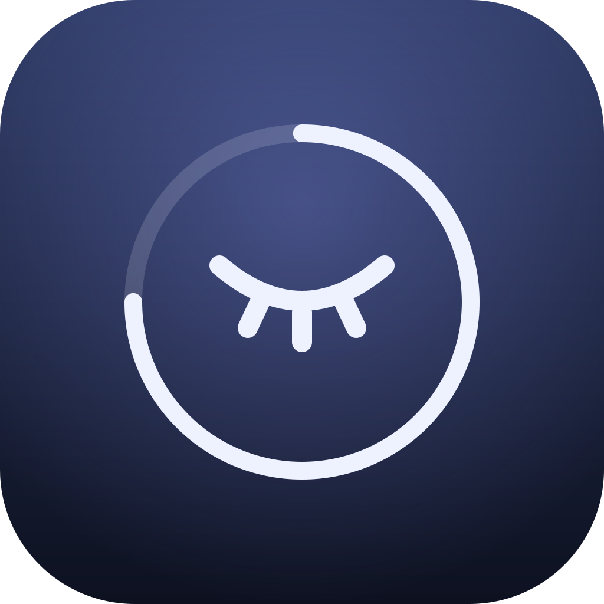
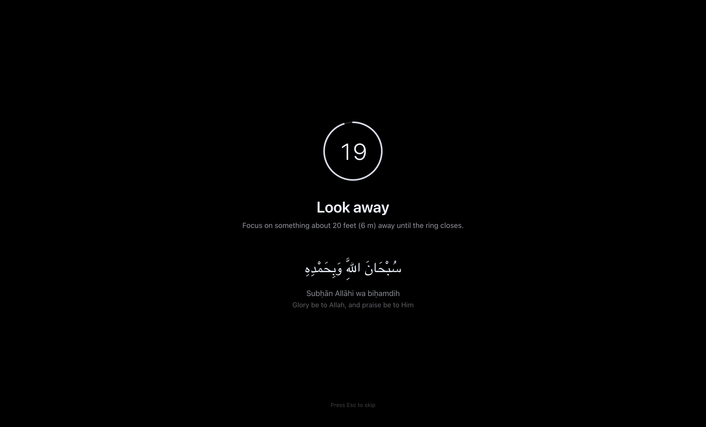
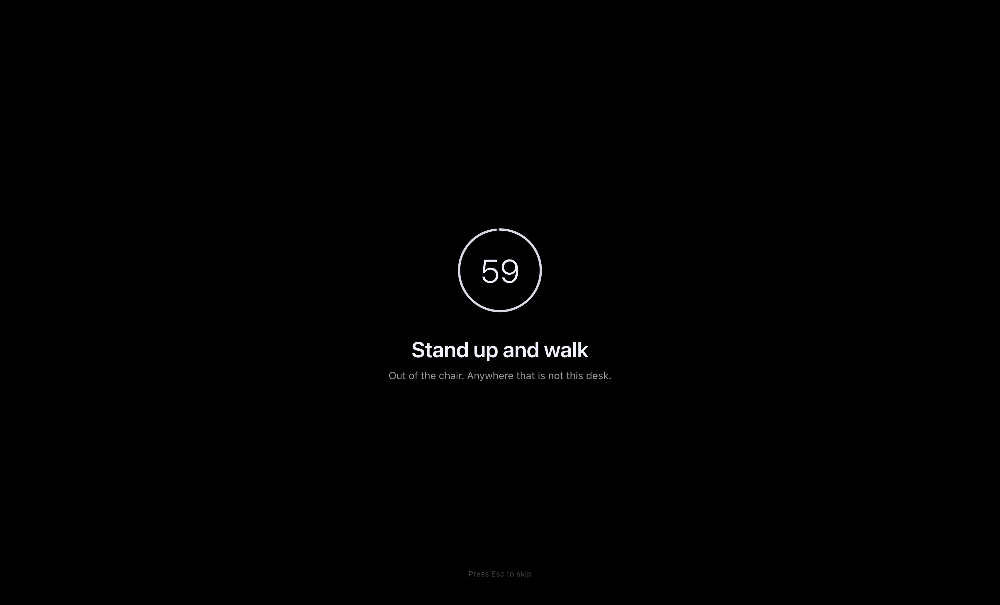
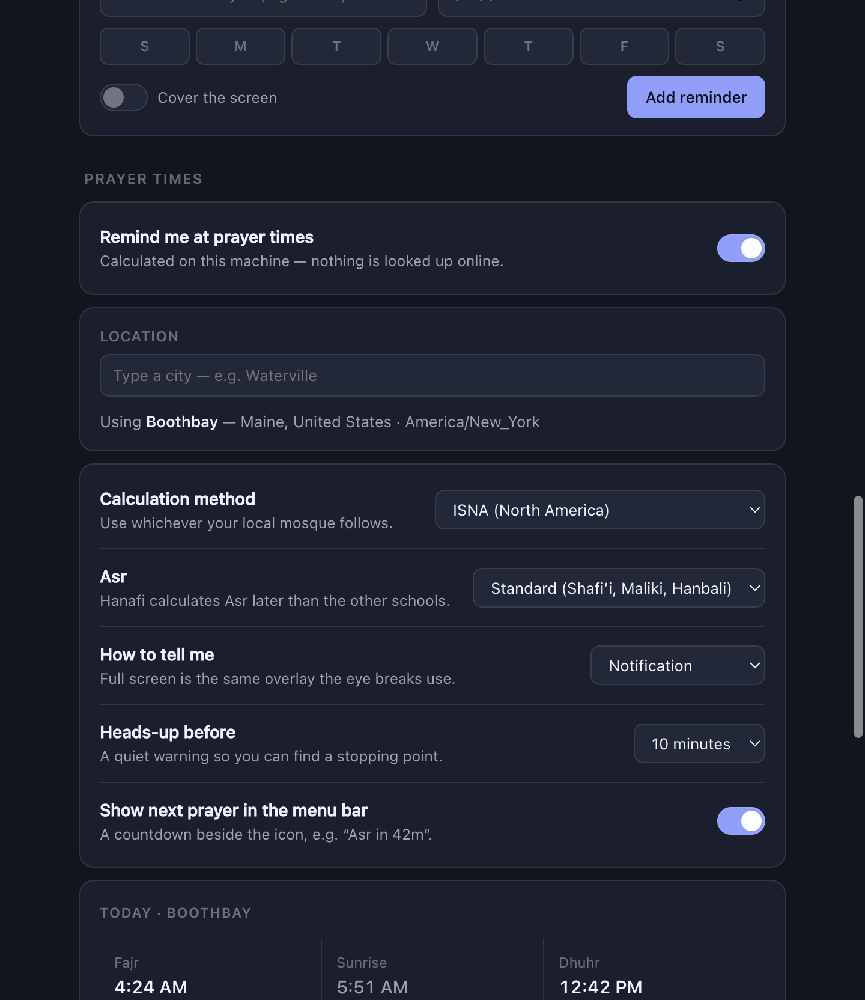

<div align="center">
  
  <h1>Sakina · سكينة</h1>
  <p><em>Stillness, on a timer.</em></p>
</div>

> This is my own branch. It has everything the public one has, plus the two
> things that are mine: the adhkar and Qur'an lines, and prayer times for
> wherever I am. The general version lives on `main`.

Sakina is a menu-bar / system-tray app for **macOS and Windows** that interrupts
you on purpose. You write the prompts and set how often each one fires. Every
display dims, a ring counts down, and your own words sit in the middle of it.

*Look away* every 20 minutes. *Stand up and walk* every hour. *Say what you just
read, out loud* every 90 minutes. Each on its own clock, in your own words.

It also knows the five prayer times where I am, and tells me before each one
arrives.

## Why I made this

I kept meaning to take breaks and never did. Nothing about staring at a screen
reminds you to stop staring at a screen, and a sticky note on the monitor lasts
about a day.

So I wrote something that interrupts me instead. Then I got curious whether the
advice I was building on top of was even true, and started reading the actual
papers rather than the blog posts about them. That is what
[Why bother](#why-bother) is — I am still working through it, and I expect to
spend a weekend or two more on it.

What is already clear is that the 20-20-20 rule is much weaker than its
popularity suggests. Someone did eventually test those exact numbers, and
twenty-second breaks made no measurable difference to symptoms, reading speed or
accuracy. The parts that hold up are less catchy: breaks do not cost you
productivity, discomfort builds while you sit, your blink rate collapses while
you read, and switching to a different task beats sitting idle if you want to
keep concentrating.

So the app has no opinion about your intervals. Write your own prompts, set your
own timings, and change them when they stop working.

The same instinct is why the prayer times are in here. The day already has a
shape — five points that break it up whether or not I am paying attention. I
would rather build my working rhythm around that than pretend the two are
separate.





## Install

Grab a build from [Releases](../../releases), or build it yourself:

```bash
npm install && npm start
```

To produce installers — `.dmg` for macOS, `.exe` for Windows:

```bash
npm run dist
```

Neither build is code-signed, so first launch needs *Open Anyway* in
**System Settings → Privacy & Security** on macOS, or *More info → Run anyway*
on Windows SmartScreen.

## What it does

| | |
| --- | --- |
| **Your prompts** | Any words you like, each with its own interval and length. Every display, above full-screen apps. |
| **Prayer times** | Fajr through Isha for your city, with a heads-up before each. |
| **Phrases** | 9 adhkar with transliteration, plus anything you add, shown under a prompt. |
| **Timed reminders** | Your own, at a clock time — as a notification or a full screen. |
| **Skips** | Won't interrupt you when you're away, presenting, or on a call. |
| **Strict mode** | Removes the Esc shortcut when you don't trust yourself. |

**Esc** skips a break. The overlay takes keyboard focus on purpose, so whatever
you type during a break lands nowhere instead of in your document.

**Nothing leaves your machine.** No account, no network call, no analytics —
prayer times are computed locally and the city list ships with the app. Settings
are a JSON file you can open from the settings window.

## Why bother

Short version: breaks probably help, but the popular numbers are not well supported. Sakina lets you set your own prompts and intervals because the evidence points at "take breaks that suit you" rather than at any specific rule.

### Resting the eyes

The 20-20-20 rule is advice from professional bodies, not a tested result. The American Academy of Ophthalmology (2023) says to "shift your eyes to look at an object at least 20 feet away, for at least 20 seconds" every 20 minutes ([aao.org](https://www.aao.org/eye-health/diseases/what-is-eye-strain)) while the same page notes that "Eye strain does not injure the eye and does not cause permanent damage."

When the numbers were actually tested, they did not hold up. Johnson and Rosenfield (2023) had 30 people read on a tablet for 40 minutes with 20-second breaks every 5, 10, 20 or 40 minutes, and found "no significant effect of scheduled breaks on reported symptoms (P = .70), reading speed (P = .93), or task accuracy (P = .55)", concluding that "these results do not support the proposal of using 20-second scheduled breaks as a therapeutic intervention for digital eye strain" ([doi:10.1097/OPX.0000000000001971](https://doi.org/10.1097/OPX.0000000000001971)). A more recent crossover study found breaks beat no breaks and endorsed "the potential benefits of individualized and frequent breaks" (Redondo et al., 2025, [doi:10.1016/j.exer.2025.110463](https://doi.org/10.1016/j.exer.2025.110463)) but the significant effects came from 10-minute and self-paced schedules, not from the 20-minute arm.

The most favourable trial (Talens-Estarelles et al., 2023) had 29 people use 20-20-20 reminders for two weeks with no control group, and even there "No changes on any ocular surface and tear film parameter were observed with the rule reminders" ([doi:10.1016/j.clae.2022.101744](https://doi.org/10.1016/j.clae.2022.101744)).

What is solid is the mechanism, not the fix: blink rate drops from about 32 to about 11 blinks per minute during reading (Chidi-Egboka et al., 2023, [doi:10.1167/iovs.64.2.14](https://doi.org/10.1167/iovs.64.2.14)), and that happens with printed paper as much as with screens. Prompting people to blink more did not help either: "Increasing the mean blink rate to 23.5 blinks per minute by means of the audible tone did not produce a significant change in the symptom score" (Portello et al., 2013, [doi:10.1097/OPX.0b013e31828f09a7](https://doi.org/10.1097/OPX.0b013e31828f09a7)). The TFOS workshop report is blunt about how weak the intervention evidence is: "In general, interventions are not well established" (Wolffsohn et al., 2023, [doi:10.1016/j.jtos.2023.04.004](https://doi.org/10.1016/j.jtos.2023.04.004)).

### Moving

Discomfort does build up while you sit: "Over time, discomfort increased in all body areas" over two hours of seated computer work (Baker et al., 2018, [doi:10.3390/ijerph15081678](https://doi.org/10.3390/ijerph15081678)).

Extra breaks are cheap. NIOSH's field study of 42 data-entry workers added 20 minutes of break time per day and reported that "These beneficial effects were obtained without reductions in data-entry performance" (Galinsky et al., 2000, [doi:10.1080/001401300184297](https://doi.org/10.1080/001401300184297)); their follow-up found "supplementary breaks reliably minimize discomfort and eyestrain without impairing productivity" (Galinsky et al., 2007, [doi:10.1002/ajim.20472](https://doi.org/10.1002/ajim.20472)). A GRADE-rated review agrees on the productivity half: "Moderate-quality evidence indicated that the use of breaks had no detrimental effect on work productivity" (Waongenngarm et al., 2018, [doi:10.1016/j.apergo.2017.12.003](https://doi.org/10.1016/j.apergo.2017.12.003)).

Whether movement fixes your back is much less clear. Cochrane: "Currently available limited evidence does not show that interventions to increase standing or walking in the workplace reduced musculoskeletal symptoms among sedentary workers at short-, medium-, or long-term follow up" (Parry et al., 2019, [doi:10.1002/14651858.CD012487.pub2](https://doi.org/10.1002/14651858.CD012487.pub2)). A 2025 meta-analysis of computer prompts specifically found they do move people (about 12.5 fewer sitting minutes and about 1,030 more steps per workday) but that "Secondary outcomes included work-related, musculoskeletal, and cardiometabolic outcomes favouring computer prompts but not statistically significant" (Leppe-Zamora et al., 2025, [doi:10.1186/s12966-025-01781-0](https://doi.org/10.1186/s12966-025-01781-0)). And workers in the 2007 study "reported stretching during only 25% of conventional breaks and 39% of supplementary breaks" — people ignore the exercise part of a prompt.

WHO backs the general idea without any timer value: "Adults should limit the amount of time spent being sedentary. Replacing sedentary time with physical activity of any intensity (including light intensity) provides health benefits" (WHO, 2020, [NBK566046](https://www.ncbi.nlm.nih.gov/books/NBK566046/)), while stating there is insufficient evidence to recommend a break frequency or duration.

### Resting attention

Micro-breaks help how you feel more than what you produce. A meta-analysis found "statistically significant but small effects of micro-breaks in boosting vigor …, reducing fatigue …, and a non-significant effect on increasing overall performance", with "Sub-groups analyses on performance types revealed significant effects only for tasks with less cognitive demands" (Albulescu et al., 2022, [doi:10.1371/journal.pone.0272460](https://doi.org/10.1371/journal.pone.0272460)).

What seems to matter is switching, not idling. Ariga and Lleras (2011) found only a group that briefly switched to a different task avoided the usual decline in vigilance, concluding "In sum, vigilance decrements are not about an exhaustion of attention, they are about a loss of control over the contents of our thoughts" ([doi:10.1016/j.cognition.2010.12.007](https://doi.org/10.1016/j.cognition.2010.12.007)). Similarly: "Surprisingly, low cognitive demand tasks yielded a stronger incubation effect than did rest during an incubation period when solving linguistic insight problems" (Sio & Ormerod, 2009, [doi:10.1037/a0014212](https://doi.org/10.1037/a0014212)).

Do not oversell the mind-wandering angle. A two-study replication attempt (N = 443) reported "we found no evidence for the claim that mind wandering during a creative-incubation interval facilitates a form of creativity associated with divergent thinking" (Murray et al., 2024, [doi:10.1037/aca0000420](https://doi.org/10.1037/aca0000420)). "Look at something green" is on similarly thin ice: a review of Attention Restoration Theory ran meta-analyses on objective attention measures and found "The remaining 10 meta-analyses did not show marked beneficial effects" (Ohly et al., 2016, [doi:10.1080/10937404.2016.1196155](https://doi.org/10.1080/10937404.2016.1196155)).

### What it adds up to

Most of these studies are small. Twenty to fifty people, one site, often a
single session under an hour. Most of what they measure is how people say they
feel, not anything a clinician would check. The reviews hedge, and one had its
own independent assessors write that its "authors' conclusions should be
interpreted with caution and may not be reliable"
([DARE record](https://www.ncbi.nlm.nih.gov/books/NBK73578/)). Even the basic
prevalence figures wobble: pooled computer vision syndrome comes out at 69%, but
the individual studies range "from 12.1 to 97.3%" (Ccami-Bernal et al., 2024,
[doi:10.1016/j.optom.2023.100482](https://doi.org/10.1016/j.optom.2023.100482)).

So none of this tells you when to take a break. The 20 in 20-20-20 was picked
because it is easy to remember, and when someone finally tested those numbers,
they did not do much.

Which is why Sakina has no opinion about your intervals. Pick something you will
actually keep, and change it when it stops working.

## Prayer times

Computed on-device with [adhan](https://github.com/batoulapps/adhan-js), so they
work on a plane with the wifi off.

- **13 calculation methods** — Muslim World League, ISNA, Umm al-Qura, Karachi,
  Diyanet, and the rest. Use whichever your local mosque follows.
- **Both Asr opinions** — standard (Shafiʼi, Maliki, Hanbali) or Hanafi.
- **Per-prayer** toggles, so Fajr can stay silent while the rest don't.
- **A heads-up** 5–20 minutes before, as a notification, so you can find a
  stopping point instead of being interrupted cold.
- **In the menu bar** — "Asr in 42m" beside the icon. macOS only; Windows has no
  room for text in the tray, so it goes in the tooltip.



Your city is chosen from a bundled list of ~34,000 places, matched by prefix and
insensitive to accents, so *krako* finds *Kraków*. The list loads on first
search rather than at startup — a tray app has no business parsing two megabytes
to show a menu.

## Prompts

A prompt is a title, an optional line underneath, an interval, and a duration.
That is the whole model. The default one says *Look away* every 20 minutes for
20 seconds, and every part of it is editable, including the words.

Each prompt runs its own clock, so they drift in and out of step naturally.
When two come due at once only one fires; the other waits a couple of minutes
rather than stacking a second full-screen overlay on top of the first.

A prompt can optionally show a rotating **phrase** underneath its title:

- **Adhkar** — 9 short phrases in Arabic, with transliteration and translation,
  short enough to say two or three times with your eyes off the screen.
- **Your own** — any text, with an optional right-to-left toggle.

Phrases rotate **in order** so you see the whole set instead of the same two
lines all morning.

## The two guards

A full-screen overlay is an unusually rude thing to get wrong, so it checks
before covering anything:

- **Away** — skipped if there's been no keyboard or mouse input for *five*
  minutes. The long threshold is deliberate. Idle input is a poor proxy for
  rested eyes: reading a page for four minutes without touching anything is
  peak strain, and a thirty-second threshold would cancel exactly the breaks
  you most need.
- **Presenting** — postponed while you're on a call, sharing a screen, or
  watching something. Rather than dropping the cycle it retries every 60
  seconds, so the break lands as soon as you're free.

Waking, unlocking, or returning from sleep restarts the interval instead of
firing a break the instant the lid opens.

Each platform answers "is now a bad time" differently:

| | macOS | Windows |
| --- | --- | --- |
| Idle | `powerMonitor.getSystemIdleTime` | same |
| Presenting | `pmset -g assertions` — display-sleep assertions | `SHQueryUserNotificationState` — presentation mode, full-screen D3D, Focus Assist |

Both fail *open*: if the check errors, the break happens. The worst case is a
break you'd rather have deferred, never a break that silently stops happening.

## Platform status

**macOS** — developed and verified here. The overlay is confirmed reaching the
screen at screen-saver level across every display and clearing afterwards. The
prayer engine has been checked against an independent NOAA solar-position
implementation across 16 cities and 4 dates: every time agrees within about two
minutes, and the result is byte-identical whatever timezone the machine itself
is set to.

Known limits: inside the polar circles the times are adhan's *Aqrab Balad*
approximation — ordered and usable, but at Tromsø in December they compress into
a 71-minute notional day (Dhuhr 11:43, Asr 11:47). That is inherent to the
problem, not a bug, but do not rely on it above the Arctic Circle.

**Windows** — built from the documented APIs but **not yet exercised on a
Windows machine**. Everything except the presenting check is platform-neutral
Electron. If you run it there and something is off, that's the first place to
look. Cross-building the `.exe` from macOS also needs Wine; building on
Windows itself needs nothing extra.

## Development

```bash
npm start                        # run it
npm test                         # the test suite (runs under Electron)
npm run icons                    # regenerate icons from assets/*.svg
npx electron scripts/shoot.js    # screenshot every window to shots/
```

Every case in `test/run.js` is there because something was actually broken —
Isha silently never firing in London, no alerts at all at UTC+14, the scheduler
wedging permanently after an overlay collision. Run it before you touch the
scheduler or the prayer engine.

That last one matters more than it looks. The only other way to check the break
screen is to black out every display and wait twenty seconds, which is useless
when you're iterating on a layout — it's how the phrase-sizing bug and a
show/hide bug in these screenshots got caught.

```
src/main/       per-prompt scheduler, tray, overlay windows, prayer engine
src/preload/    the narrow bridge into each renderer
src/renderer/   break screen, settings, first-run
data/           bundled city list (see Credits)
test/           the suite behind `npm test`
macos-native/   see below
```

`adhan` is pinned to **4.4.3** on purpose: 4.4.4 ships `"type": "module"` while
its own CommonJS build still uses `require()`, so `require('adhan')` throws
*"exports is not defined in ES module scope"* in Electron's main process.

To rebuild the city list, download `cities15000.txt`, `countryInfo.txt`, and
`admin1CodesASCII.txt` from [GeoNames](https://download.geonames.org/export/dump/),
then:

```bash
node scripts/build-cities.js <dir-with-those-files> data/cities.json.gz
```

## macos-native

A separate, self-contained Swift/AppKit implementation of the eye-break half,
written before the cross-platform one. ~700 lines, no runtime, launches
instantly:

```bash
cd macos-native && make run
```

It has one fixed break cycle, the adhkar and the two guards — but no custom
prompts, prayer times, timed reminders, or settings window. Keep it if you want the lighter
native thing on a Mac; ignore it otherwise.

## Credits

- The papers quoted under [Why bother](#why-bother) belong to their authors;
  each quote links to its DOI. Every one was checked against the source rather
  than quoted from memory, and one candidate was dropped for being a
  meaning-altering truncation.
- Prayer times: [adhan-js](https://github.com/batoulapps/adhan-js) by Batoul Apps (MIT).
- City data: [GeoNames](https://www.geonames.org), licensed
  [CC BY 4.0](https://creativecommons.org/licenses/by/4.0/).

## License

MIT — see [LICENSE](LICENSE).
