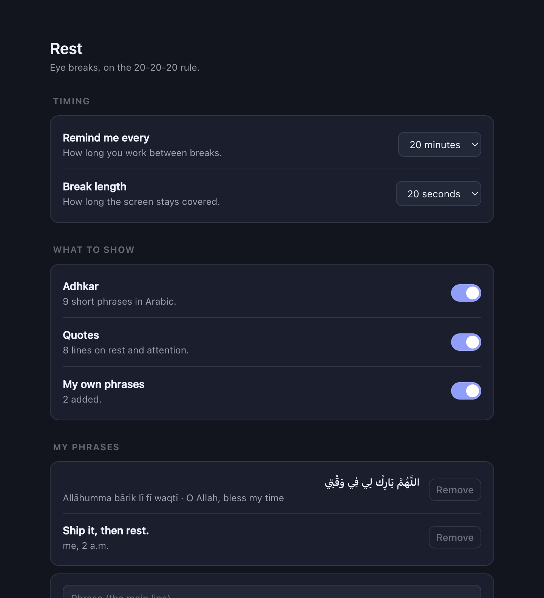

<div align="center">
  
  <h1>Rest</h1>
  <p><em>Every twenty minutes, look at something twenty feet away for twenty seconds.</em></p>
</div>

Rest is a menu-bar / system-tray app for **macOS and Windows**. On a timer, every
display dims, a ring counts down, and a phrase sits underneath it — an Arabic
dhikr, a line on rest and attention, or something you wrote yourself. When the
ring closes, it lets you back.

It exists because the 20-20-20 rule is trivial advice and impossible to keep:
nothing about staring at a screen reminds you to stop staring at a screen.


## Install

Grab a build from [Releases](../../releases), or build it yourself:

```bash
npm install && npm start
```

To produce installers — `.dmg` for macOS, `.exe` for Windows:

```bash
npm run dist
```

Neither build is code-signed, so first launch needs *Open Anyway* in
**System Settings → Privacy & Security** on macOS, or *More info → Run anyway*
on Windows SmartScreen.

## What it does

| | |
| --- | --- |
| **Breaks** | Every 15–60 min, for 20–60 seconds. Every display, above full-screen apps. |
| **Phrases** | 9 adhkar with transliteration, 8 sourced quotes, plus anything you add. |
| **Timed reminders** | Separate from the cycle — "Dhuhr at 13:00", as a notification or a full screen. |
| **Skips** | Won't interrupt you when you're away, presenting, or on a call. |
| **Strict mode** | Removes the Esc shortcut when you don't trust yourself. |

**Esc** skips a break. The overlay takes keyboard focus on purpose, so whatever
you type during a break lands nowhere instead of in your document.

Nothing leaves your machine. There is no account, no network call, and no
analytics — settings are a JSON file you can open from the settings window.

## The phrases

Three packs, each switchable, rotating **in order** so you see the whole set
instead of the same two lines all morning.

- **Adhkar** — short enough to say two or three times with your eyes off the
  screen, shown with transliteration and translation.
- **Quotes** — every line carries its source. Where something is only
  *traditionally* attributed, it says so rather than implying a citation that
  doesn't exist.
- **Your own** — any text, with an optional right-to-left toggle.



## The two guards

A full-screen overlay is an unusually rude thing to get wrong, so it checks
before covering anything:

- **Away** — skipped if there's been no keyboard or mouse input for *five*
  minutes. The long threshold is deliberate. Idle input is a poor proxy for
  rested eyes: reading a page for four minutes without touching anything is
  peak strain, and a thirty-second threshold would cancel exactly the breaks
  you most need.
- **Presenting** — postponed while you're on a call, sharing a screen, or
  watching something. Rather than dropping the cycle it retries every 60
  seconds, so the break lands as soon as you're free.

Waking, unlocking, or returning from sleep restarts the interval instead of
firing a break the instant the lid opens.

Each platform answers "is now a bad time" differently:

| | macOS | Windows |
| --- | --- | --- |
| Idle | `powerMonitor.getSystemIdleTime` | same |
| Presenting | `pmset -g assertions` — display-sleep assertions | `SHQueryUserNotificationState` — presentation mode, full-screen D3D, Focus Assist |

Both fail *open*: if the check errors, the break happens. The worst case is a
break you'd rather have deferred, never a break that silently stops happening.

## Platform status

**macOS** — developed and verified here. The overlay is confirmed reaching the
screen at screen-saver level across every display, and clearing afterwards.

**Windows** — built from the documented APIs but **not yet exercised on a
Windows machine**. Everything except the presenting check is platform-neutral
Electron. If you run it there and something is off, that's the first place to
look. Cross-building the `.exe` from macOS also needs Wine; building on
Windows itself needs nothing extra.

## Development

```bash
npm start                 # run it
npm run icons             # regenerate icons from assets/*.svg
npx electron scripts/shoot.js   # screenshot every window to shots/
```

That last one matters more than it looks. The only other way to check the break
screen is to black out every display and wait twenty seconds, which is useless
when you're iterating on a layout — it's how the phrase-sizing bug in these
screenshots got caught.

```
src/main/       scheduler, tray, overlay windows, presence checks
src/preload/    the two-verb bridge into each renderer
src/renderer/   break screen, settings, first-run
macos-native/   see below
```

## macos-native

A separate, self-contained Swift/AppKit implementation of the same idea, built
before the cross-platform one. ~700 lines, no runtime, launches instantly:

```bash
cd macos-native && make run
```

It has the breaks, the adhkar and the two guards, but not the custom phrases,
timed reminders, or settings window — those live only in the Electron app. Keep
it if you want the lighter native thing on a Mac; ignore it otherwise.

## License

MIT — see [LICENSE](LICENSE).
